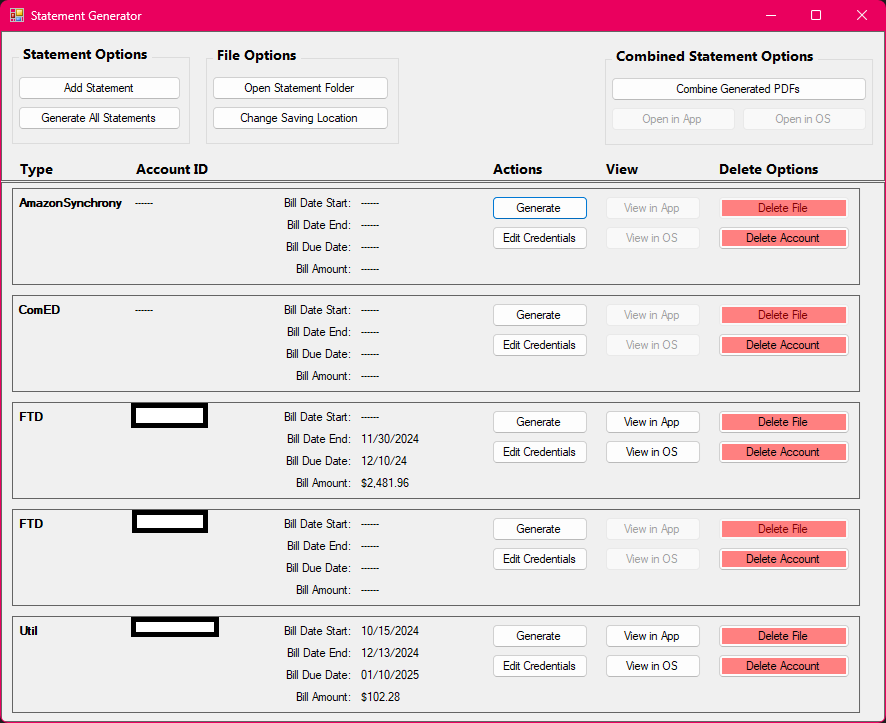

# StatementGenerator

**StatementGenerator** is a Windows application designed to automate the process of retrieving and generating statement PDFs from various service providers. This application utilizes Python scripts to web scrape designated websites for the latest billing statements, making bill management more efficient.

## Background

This project was inspired by my non-tech-savvy mom. With so many services moving to paperless billing—and some even charging for physical statements—keeping track of bills has become increasingly challenging. **StatementGenerator** aims to simplify this process by automatically downloading and organizing statements, reducing the hassle of manual retrieval.

## Features

- **Automated Statement Retrieval**: Extracts the latest statements from supported service providers.
- **Multi-Service Support**: Currently supports:
  - **ComEd**
  - **PeoplesGas**
  - **FTD**
  - **Xfinity**
  - **Amazon Synchrony**
  - **Chicago Utility**
- **PDF Generation**: Consolidates statements into easy-to-access PDFs.
- **Web Scraping Integration**: Uses Python scripts with Selenium, BeautifulSoup, and Requests to navigate service provider websites.

## Installation & Usage

### Prerequisites

This application is backed by Python web scraping, so you will need to have at least Python 3.8. To ease installation, it is recommended to have the `pip` and `pipreqs` libraries installed.

### Running the Application

1. Clone the repository:
   ```bash
   git clone https://github.com/fsoto-GH/StatementGenerator.git
   ```
2. Navigate to the project directory:
   ```bash
   cd StatementGenerator
   ```
3. Run the following command to install the required Python libraries or manually install them.
   ```bash
   pip install -r requirements.txt
   ```
4. Open the solution file in Visual Studio.
5. Build the project to restore dependencies.
6. Run the application using Visual Studio or publish it as an executable.

## Tech Stack

- **Programming Language**: Python
- **Libraries Used**:
  - **BeautifulSoup** (for parsing HTML)
  - **Selenium** (for automating website navigation)
  - **Requests** (for handling HTTP requests)
  - **PyPDF** (for working with PDF files)
- **GUI**: Windows Forms

## Screenshots



## Future Enhancements

- Support for additional service providers.
- Improved error handling for website changes or login failures.

## License

This project is licensed under the [MIT License](LICENSE).
